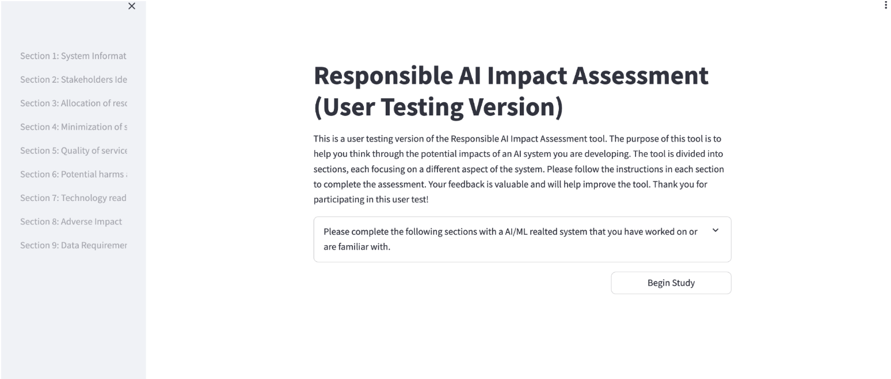

# Collab RAI Tool

## Introduction
This tool aims to assist non-experts in considering Responsible AI concerns for their ML systems. The tool produces severe, surprising, concrete, relevant, and diverse scenarios within the context of the user’s system to engage the users. The scenarios represent how stakeholders can be potentially harmed by the system’s output.

## Installation
Clone the repository: 

```bash
$ git clone https://github.com/yanxinc/collab-rai-tool.git
$ cd collab-rai-tool
```

Create and activate environment; Install dependencies

```bash
$ python -m venv .venv
$ source .venv/bin/activate
$ pip install -r app/backend/requirements.txt
$ pip install -r app/frontend/requirements.txt
```

Navigate to the `collab-rai-tool/app/helpers` folder and create a new file called `cred.py` with your OpenAI key

```python
KEY = '{your_openai_key}'
```

Navigate to the `collab-rai-tool/app/backend` folder and run `uvicorn main:app --port 8502 --reload` to start the backend server

Navigate back to the `collab-rai-tool/` folder and then start the Streamlit frontend

- Full Version
```bash
$ streamlit run app/frontend/app.py
```
- User Testing Version 1 (with Fairness Goal 2 before Fairness Goal 3)
```bash
$ streamlit run app/frontend_test_version/app.py`
```
- User Testing Version 2 (with Fairness Goal 3 before Fairness Goal 2)
```bash
$ streamlit run app/frontend_test_version2/app.py
```

If this opens our Collab RAI Impact Assessment app in your browser, you're all set!

## Deploying with Docker
Prerequisites
- Install [Docker Engine](https://docs.docker.com/engine/install/#server)
- Check network port accessibility
  - Make sure you can access ports 8501-8504 as these are the default ports that our app uses
    - Port 8501: Full Version of App
    - Port 8502: Backend pipeline service
    - Port 8503: User Testing Version 1
    - Port 8504: User Testing Version 2
  - If these ports are unavailable, change them in the `Dockerfile` and the `docker-compose.yml` files

Start deploying by running the following command
```bash
$ docker-compose up -d --build --remove-orphans
```

Note: 
- Currently deployed at feature.isri.cmu.edu
  - E.g. Visit http://feature.isri.cmu.edu:8503/ to access User Testing Version 1 of the app
- Files are located at `/home/cindy/collab-rai-tool`

## Using the App for User Testing
Go to http://feature.isri.cmu.edu:8503/ or http://feature.isri.cmu.edu:8504/ in your browser to access the RAI Impact Assessment




Go to http://feature.isri.cmu.edu:8502/logs in your browser to view the log messages.
Note that the logs are displayed in reverse line order.

To change the logging level, navigate to the `collab-rai-tool/app/backend/pipeline.py` file and change the level in `logging.basicConfig`. Options include `NOTSET`, `DEBUG`, `INFO`, `WARN`, `ERROR`, and `CRITICAL`. Then, rebuild the app. 

